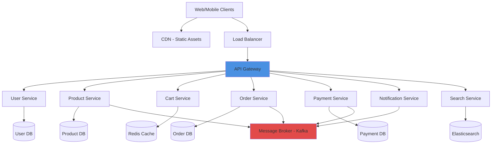

# Microservices Architecture - E-commerce Platform

Complete microservices architecture design for a scalable e-commerce platform.

## 📝 Prompt

```
Design a microservices architecture for an e-commerce platform:

Context:
- Expected traffic: 10,000 concurrent users
- Global user base across multiple regions
- Peak traffic during sales (10x normal)
- Real-time inventory management
- Payment processing with PCI compliance
- Mobile and web clients

Requirements:
- High availability (99.9%+)
- Scalable to handle traffic spikes
- Fast response times (< 200ms for most operations)
- Secure payment processing
- Real-time order tracking
- Inventory synchronization

Include:
- Service decomposition strategy
- Architecture diagram with all services
- Communication patterns (sync/async)
- Data management strategy
- API Gateway configuration
- Service discovery and load balancing
- Resilience patterns (circuit breakers, retries)
- Deployment strategy
- Monitoring and observability
```

## 🏗️ Architecture Overview

### High-Level Architecture



## 📐 Service Decomposition

### 1. User Service
**Responsibility**: User authentication, authorization, profile management

**Endpoints**:
- `POST /api/users/register` - User registration
- `POST /api/users/login` - User login
- `GET /api/users/{id}` - Get user profile
- `PUT /api/users/{id}` - Update profile
- `POST /api/users/password/reset` - Password reset

**Technology Stack**:
- Node.js with Express
- PostgreSQL (user data)
- Redis (session management)
- JWT for authentication

**Data Model**:
```sql
CREATE TABLE users (
    id UUID PRIMARY KEY,
    email VARCHAR(255) UNIQUE NOT NULL,
    password_hash VARCHAR(255) NOT NULL,
    first_name VARCHAR(100),
    last_name VARCHAR(100),
    phone VARCHAR(20),
    created_at TIMESTAMP DEFAULT NOW(),
    updated_at TIMESTAMP DEFAULT NOW()
);

CREATE TABLE addresses (
    id UUID PRIMARY KEY,
    user_id UUID REFERENCES users(id),
    type VARCHAR(20), -- shipping, billing
    address_line1 VARCHAR(255),
    city VARCHAR(100),
    country VARCHAR(100),
    postal_code VARCHAR(20),
    is_default BOOLEAN DEFAULT false
);
```

---

### 2. Product Service
**Responsibility**: Product catalog management, inventory tracking

**Endpoints**:
- `GET /api/products` - List products (with pagination)
- `GET /api/products/{id}` - Get product details
- `POST /api/products` - Create product (admin)
- `PUT /api/products/{id}` - Update product (admin)
- `GET /api/products/{id}/inventory` - Check inventory
- `POST /api/products/{id}/inventory/reserve` - Reserve inventory

**Technology Stack**:
- Java Spring Boot
- PostgreSQL (product catalog)
- Redis (inventory cache)
- Elasticsearch (product search)

**Data Model**:
```sql
CREATE TABLE products (
    id UUID PRIMARY KEY,
    name VARCHAR(255) NOT NULL,
    description TEXT,
    price DECIMAL(10,2) NOT NULL,
    category_id UUID,
    image_urls TEXT[],
    created_at TIMESTAMP DEFAULT NOW(),
    updated_at TIMESTAMP DEFAULT NOW()
);

CREATE TABLE inventory (
    product_id UUID PRIMARY KEY REFERENCES products(id),
    quantity INT NOT NULL DEFAULT 0,
    reserved INT NOT NULL DEFAULT 0,
    available INT GENERATED ALWAYS AS (quantity - reserved) STORED,
    last_updated TIMESTAMP DEFAULT NOW()
);
```

**Inventory Management**:
```java
@Service
public class InventoryService {
    
    @Transactional
    public boolean reserveInventory(UUID productId, int quantity) {
        // Pessimistic locking to prevent overselling
        Inventory inv = inventoryRepository
            .findByIdWithLock(productId)
            .orElseThrow();
        
        if (inv.getAvailable() >= quantity) {
            inv.setReserved(inv.getReserved() + quantity);
            inventoryRepository.save(inv);
            
            // Publish event
            eventPublisher.publish(new InventoryReservedEvent(productId, quantity));
            return true;
        }
        return false;
    }
    
    @Transactional
    public void releaseInventory(UUID productId, int quantity) {
        Inventory inv = inventoryRepository.findById(productId).orElseThrow();
        inv.setReserved(Math.max(0, inv.getReserved() - quantity));
        inventoryRepository.save(inv);
    }
}
```

---

### 3. Cart Service
**Responsibility**: Shopping cart management

**Endpoints**:
- `GET /api/cart` - Get user's cart
- `POST /api/cart/items` - Add item to cart
- `PUT /api/cart/items/{itemId}` - Update item quantity
- `DELETE /api/cart/items/{itemId}` - Remove item
- `DELETE /api/cart` - Clear cart

**Technology Stack**:
- Python FastAPI
- Redis (cart storage)
- TTL: 7 days for inactive carts

**Cart Structure** (Redis):
```json
{
  "user:123:cart": {
    "items": [
      {
        "productId": "prod-456",
        "name": "Product Name",
        "price": 29.99,
        "quantity": 2,
        "image": "https://cdn.example.com/image.jpg"
      }
    ],
    "total": 59.98,
    "updatedAt": "2026-01-22T10:00:00Z"
  }
}
```

---

### 4. Order Service
**Responsibility**: Order processing, order history

**Endpoints**:
- `POST /api/orders` - Create order
- `GET /api/orders` - List user orders
- `GET /api/orders/{id}` - Get order details
- `PUT /api/orders/{id}/cancel` - Cancel order
- `GET /api/orders/{id}/tracking` - Track order

**Technology Stack**:
- Go
- PostgreSQL (orders)
- Kafka (event publishing)

**Data Model**:
```sql
CREATE TABLE orders (
    id UUID PRIMARY KEY,
    user_id UUID NOT NULL,
    status VARCHAR(50) NOT NULL, -- pending, processing, shipped, delivered, cancelled
    subtotal DECIMAL(10,2) NOT NULL,
    tax DECIMAL(10,2) NOT NULL,
    shipping DECIMAL(10,2) NOT NULL,
    total DECIMAL(10,2) NOT NULL,
    created_at TIMESTAMP DEFAULT NOW(),
    updated_at TIMESTAMP DEFAULT NOW()
);

CREATE TABLE order_items (
    id UUID PRIMARY KEY,
    order_id UUID REFERENCES orders(id),
    product_id UUID NOT NULL,
    product_name VARCHAR(255) NOT NULL,
    price DECIMAL(10,2) NOT NULL,
    quantity INT NOT NULL,
    subtotal DECIMAL(10,2) NOT NULL
);
```

**Order Saga Pattern** (Choreography):
```go
type OrderSaga struct {
    orderService      *OrderService
    inventoryClient   *InventoryClient
    paymentClient     *PaymentClient
    kafkaProducer     *KafkaProducer
}

func (s *OrderSaga) CreateOrder(ctx context.Context, req *CreateOrderRequest) error {
    // 1. Create order in pending state
    order, err := s.orderService.Create(ctx, req)
    if err != nil {
        return err
    }
    
    // 2. Reserve inventory
    if err := s.inventoryClient.Reserve(ctx, order.Items); err != nil {
        s.orderService.Cancel(ctx, order.ID)
        return err
    }
    
    // 3. Process payment
    if err := s.paymentClient.Charge(ctx, order); err != nil {
        // Compensating transaction: release inventory
        s.inventoryClient.Release(ctx, order.Items)
        s.orderService.Cancel(ctx, order.ID)
        return err
    }
    
    // 4. Mark order as processing
    s.orderService.UpdateStatus(ctx, order.ID, "processing")
    
    // 5. Publish event
    s.kafkaProducer.Publish("order.created", order)
    
    return nil
}
```

---

### 5. Payment Service
**Responsibility**: Payment processing (PCI compliant)

**Endpoints**:
- `POST /api/payments/intent` - Create payment intent
- `POST /api/payments/confirm` - Confirm payment
- `POST /api/payments/refund` - Process refund
- `GET /api/payments/{id}` - Get payment status

**Technology Stack**:
- Node.js
- Stripe API integration
- PostgreSQL (payment records)
- Encrypted at rest

**Security Features**:
- PCI DSS Level 1 compliant
- Tokenization (never store card details)
- 3D Secure authentication
- Fraud detection
- Audit logging

```javascript
// Payment Service - Stripe Integration
class PaymentService {
    async createPaymentIntent(amount, currency, orderId) {
        const paymentIntent = await stripe.paymentIntents.create({
            amount: amount * 100, // cents
            currency,
            metadata: { orderId },
            automatic_payment_methods: { enabled: true }
        });
        
        // Store payment intent
        await db.payments.create({
            id: paymentIntent.id,
            orderId,
            amount,
            currency,
            status: 'pending'
        });
        
        return {
            clientSecret: paymentIntent.client_secret,
            paymentIntentId: paymentIntent.id
        };
    }
    
    async confirmPayment(paymentIntentId) {
        const payment = await stripe.paymentIntents.retrieve(paymentIntentId);
        
        if (payment.status === 'succeeded') {
            await db.payments.update(paymentIntentId, {
                status: 'completed',
                completedAt: new Date()
            });
            
            // Publish event
            await kafka.publish('payment.succeeded', {
                orderId: payment.metadata.orderId,
                paymentId: paymentIntentId
            });
            
            return true;
        }
        
        return false;
    }
}
```

---

### 6. Notification Service
**Responsibility**: Email, SMS, push notifications

**Endpoints**:
- `POST /api/notifications/email` - Send email
- `POST /api/notifications/sms` - Send SMS
- `POST /api/notifications/push` - Send push notification

**Technology Stack**:
- Python
- SendGrid (email)
- Twilio (SMS)
- Firebase Cloud Messaging (push)
- RabbitMQ (message queue)

**Event Consumers**:
```python
# Notification Service - Event Handlers
class NotificationEventHandler:
    def __init__(self, kafka_consumer):
        self.kafka_consumer = kafka_consumer
        self.handlers = {
            'order.created': self.handle_order_created,
            'payment.succeeded': self.handle_payment_succeeded,
            'order.shipped': self.handle_order_shipped,
        }
    
    async def handle_order_created(self, event):
        user = await self.get_user(event['userId'])
        await self.send_email(
            to=user['email'],
            template='order_confirmation',
            data=event
        )
    
    async def handle_payment_succeeded(self, event):
        await self.send_email(
            template='payment_receipt',
            data=event
        )
    
    async def handle_order_shipped(self, event):
        await self.send_email(
            template='shipping_notification',
            data=event
        )
        await self.send_sms(
            phone=event['phone'],
            message=f"Your order #{event['orderNumber']} has shipped!"
        )
```

---

### 7. Search Service
**Responsibility**: Product search and recommendations

**Endpoints**:
- `GET /api/search?q={query}` - Search products
- `GET /api/search/suggestions?q={query}` - Auto-complete
- `GET /api/recommendations/{userId}` - Personalized recommendations

**Technology Stack**:
- Elasticsearch
- Python
- Machine Learning for recommendations

---

## 🔄 Communication Patterns

### Synchronous Communication (REST/gRPC)
- **Use cases**: Real-time queries, user-facing operations
- **Examples**: 
  - Client → API Gateway → Services
  - Cart Service → Product Service (price lookup)

### Asynchronous Communication (Events)
- **Use cases**: Long-running operations, eventual consistency
- **Examples**:
  - Order created → Inventory reserved
  - Payment succeeded → Order processing
  - Order shipped → Notification sent

**Kafka Topics**:
```yaml
Topics:
  - order.created
  - order.updated
  - order.cancelled
  - payment.succeeded
  - payment.failed
  - inventory.reserved
  - inventory.released
  - notification.email
  - notification.sms
```

---

## 🛡️ Resilience Patterns

### 1. Circuit Breaker
```javascript
// Using opossum circuit breaker
const CircuitBreaker = require('opossum');

const options = {
    timeout: 3000, // 3 seconds
    errorThresholdPercentage: 50,
    resetTimeout: 30000 // 30 seconds
};

const breaker = new CircuitBreaker(callExternalService, options);

breaker.fallback(() => {
    return { fallback: true, message: 'Service temporarily unavailable' };
});

// Usage
try {
    const result = await breaker.fire(params);
} catch (err) {
    // Handle error
}
```

### 2. Retry with Exponential Backoff
```python
from tenacity import retry, stop_after_attempt, wait_exponential

@retry(
    stop=stop_after_attempt(3),
    wait=wait_exponential(multiplier=1, min=2, max=10)
)
async def call_service_with_retry(url, data):
    async with httpx.AsyncClient() as client:
        response = await client.post(url, json=data)
        response.raise_for_status()
        return response.json()
```

### 3. Timeout Configuration
```yaml
# Service mesh timeout configuration (Istio)
apiVersion: networking.istio.io/v1alpha3
kind: VirtualService
metadata:
  name: product-service
spec:
  hosts:
    - product-service
  http:
    - timeout: 5s
      retries:
        attempts: 3
        perTryTimeout: 2s
        retryOn: 5xx,reset,connect-failure,refused-stream
```

---

## 🚀 Deployment Strategy

### Kubernetes Deployment
```yaml
# API Gateway Deployment
apiVersion: apps/v1
kind: Deployment
metadata:
  name: api-gateway
spec:
  replicas: 3
  selector:
    matchLabels:
      app: api-gateway
  template:
    metadata:
      labels:
        app: api-gateway
    spec:
      containers:
        - name: gateway
          image: ecommerce/api-gateway:v1.0.0
          ports:
            - containerPort: 8080
          env:
            - name: USER_SERVICE_URL
              value: "http://user-service:8080"
            - name: PRODUCT_SERVICE_URL
              value: "http://product-service:8080"
          resources:
            requests:
              cpu: 200m
              memory: 256Mi
            limits:
              cpu: 500m
              memory: 512Mi
          livenessProbe:
            httpGet:
              path: /health
              port: 8080
            initialDelaySeconds: 30
            periodSeconds: 10
          readinessProbe:
            httpGet:
              path: /ready
              port: 8080
            initialDelaySeconds: 10
            periodSeconds: 5
```

---

## 📊 Monitoring & Observability

### Metrics to Track
```yaml
Service Health:
  - Request rate
  - Error rate
  - Response time (p50, p95, p99)
  - CPU/Memory usage

Business Metrics:
  - Orders per minute
  - Revenue per hour
  - Cart abandonment rate
  - Checkout conversion rate

Infrastructure:
  - Pod restarts
  - Network latency
  - Database connections
  - Message queue depth
```

### Distributed Tracing
```javascript
// OpenTelemetry tracing
const { trace } = require('@opentelemetry/api');

const tracer = trace.getTracer('order-service');

async function createOrder(orderData) {
    const span = tracer.startSpan('createOrder');
    
    try {
        // Reserve inventory
        const inventorySpan = tracer.startSpan('reserveInventory', { parent: span });
        await inventoryService.reserve(orderData.items);
        inventorySpan.end();
        
        // Process payment
        const paymentSpan = tracer.startSpan('processPayment', { parent: span });
        await paymentService.charge(orderData.total);
        paymentSpan.end();
        
        span.setStatus({ code: SpanStatusCode.OK });
    } catch (error) {
        span.setStatus({ code: SpanStatusCode.ERROR, message: error.message });
        throw error;
    } finally {
        span.end();
    }
}
```

---

## 💡 Best Practices

1. **Service Independence** - Each service should be deployable independently
2. **Database per Service** - No shared databases between services
3. **API Versioning** - Use versioned APIs (v1, v2) for backward compatibility
4. **Idempotency** - All operations should be idempotent
5. **Event Sourcing** - Consider event sourcing for audit trails
6. **Graceful Degradation** - System should work even if some services are down
7. **Rate Limiting** - Implement rate limiting at API Gateway
8. **Caching** - Cache aggressively (Redis, CDN)
9. **Security** - Implement authentication at Gateway, authorization at services
10. **Documentation** - Maintain OpenAPI specs for all services

---

## 🎯 Scalability Targets

- **Concurrent Users**: 10,000 → 100,000
- **Orders per Second**: 100 → 1,000
- **Response Time**: < 200ms for 95th percentile
- **Availability**: 99.9% (43 minutes downtime/month)
- **Database**: Read replicas, sharding when needed
- **Horizontal Scaling**: Auto-scaling based on CPU/memory

---

## 🔐 Security Considerations

1. **API Gateway**: Rate limiting, DDoS protection, API key validation
2. **Service-to-Service**: mTLS, service mesh (Istio)
3. **Data Encryption**: At rest (database) and in transit (TLS)
4. **Secrets Management**: HashiCorp Vault or AWS Secrets Manager
5. **Compliance**: PCI DSS for payment service
6. **Audit Logging**: All critical operations logged
7. **Input Validation**: At API Gateway and service level
8. **Authentication**: JWT tokens with short expiry
