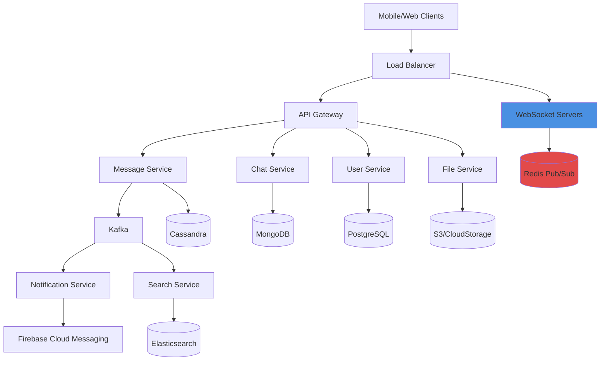

# System Design - Real-Time Chat Application

Complete system design for a scalable real-time chat application supporting millions of concurrent users.

## 📝 Prompt

```
Design a real-time chat application with high scalability:

Context:
- Support 10 million concurrent users
- Real-time message delivery (< 100ms latency)
- Group chats (up to 1000 members)
- File sharing (images, videos, documents)
- End-to-end encryption
- Message history and search
- Read receipts and typing indicators
- Push notifications
- Multi-device support

Requirements:
- High availability (99.99%)
- Low latency globally
- Horizontal scalability
- Data persistence
- Real-time features
- Security and privacy
- Cost optimization

Include:
- Architecture diagram
- Technology choices with justification
- Data models
- API design
- Scalability strategy
- Caching strategy
- Real-time communication protocol
- Storage strategy
- CDN usage
```

## 🏗️ System Architecture



## 📊 Capacity Planning

### Expected Load
- **Users**: 10M concurrent, 100M total
- **Messages**: 1M messages/second at peak
- **Groups**: 50M groups, avg 50 members each
- **Files**: 10TB uploaded daily
- **Storage**: 1PB total message history

### Infrastructure
- **WebSocket Servers**: 1,000 servers (10K connections each)
- **API Servers**: 500 servers
- **Cassandra Cluster**: 100 nodes
- **Redis Cluster**: 50 nodes
- **Kafka Cluster**: 30 brokers

## 💾 Data Models

### User Service (PostgreSQL)
```sql
CREATE TABLE users (
    id UUID PRIMARY KEY,
    username VARCHAR(50) UNIQUE NOT NULL,
    email VARCHAR(255) UNIQUE NOT NULL,
    phone VARCHAR(20),
    avatar_url TEXT,
    status VARCHAR(20) DEFAULT 'offline', -- online, offline, away
    last_seen TIMESTAMP,
    created_at TIMESTAMP DEFAULT NOW()
);

CREATE INDEX idx_users_username ON users(username);
CREATE INDEX idx_users_email ON users(email);
```

### Chat Service (MongoDB)
```javascript
// Chat document
{
  _id: ObjectId("..."),
  type: "private", // private, group, channel
  name: "Group Chat Name", // for groups only
  participants: [
    {
      userId: "user-123",
      role: "admin", // admin, member
      joinedAt: ISODate("2026-01-20T10:00:00Z"),
      lastRead: ISODate("2026-01-22T09:00:00Z")
    }
  ],
  metadata: {
    createdBy: "user-123",
    createdAt: ISODate("2026-01-20T10:00:00Z"),
    updatedAt: ISODate("2026-01-22T10:00:00Z")
  },
  settings: {
    isEncrypted: true,
    retentionDays: 90
  }
}
```

### Message Service (Cassandra)
```sql
-- Optimized for write-heavy workload and time-series queries
CREATE TABLE messages (
    chat_id UUID,
    message_id TIMEUUID,
    sender_id UUID,
    content TEXT,
    type VARCHAR, -- text, image, video, file, system
    metadata MAP<TEXT, TEXT>,
    encrypted BOOLEAN,
    created_at TIMESTAMP,
    PRIMARY KEY ((chat_id), created_at, message_id)
) WITH CLUSTERING ORDER BY (created_at DESC);

-- Index for message search
CREATE INDEX ON messages (sender_id);
```

## 🔌 WebSocket Architecture

### Connection Management
```javascript
// WebSocket Server
class ChatWebSocketServer {
    constructor() {
        this.connections = new Map(); // userId -> WebSocket
        this.redis = new Redis.Cluster([/* nodes */]);
        this.kafka = new Kafka.Producer();
    }
    
    async handleConnection(ws, userId) {
        // Store connection
        this.connections.set(userId, ws);
        
        // Subscribe to user's Redis channel
        await this.redis.subscribe(`user:${userId}:messages`);
        
        // Update user status
        await this.updateUserStatus(userId, 'online');
        
        ws.on('message', (data) => this.handleMessage(userId, data));
        ws.on('close', () => this.handleDisconnection(userId));
    }
    
    async handleMessage(senderId, data) {
        const message = JSON.parse(data);
        
        // Validate and sanitize
        if (!this.validateMessage(message)) {
            return;
        }
        
        // Generate message ID
        message.id = uuidv4();
        message.timestamp = Date.now();
        message.senderId = senderId;
        
        // Publish to Kafka for persistence
        await this.kafka.send({
            topic: 'chat.messages',
            messages: [{ value: JSON.stringify(message) }]
        });
        
        // Publish to Redis for real-time delivery
        await this.redis.publish(
            `chat:${message.chatId}:messages`,
            JSON.stringify(message)
        );
        
        // Ack to sender
        this.sendToUser(senderId, {
            type: 'ack',
            messageId: message.id
        });
    }
    
    async handleDisconnection(userId) {
        this.connections.delete(userId);
        await this.redis.unsubscribe(`user:${userId}:messages`);
        await this.updateUserStatus(userId, 'offline');
    }
    
    sendToUser(userId, message) {
        const ws = this.connections.get(userId);
        if (ws && ws.readyState === WebSocket.OPEN) {
            ws.send(JSON.stringify(message));
        }
    }
}
```

### Message Distribution
```python
# Redis Pub/Sub Subscriber
import redis
import json

class MessageDistributor:
    def __init__(self, redis_client, websocket_manager):
        self.redis = redis_client
        self.ws_manager = websocket_manager
        self.pubsub = self.redis.pubsub()
    
    async def start(self):
        """Subscribe to all chat channels"""
        await self.pubsub.psubscribe('chat:*:messages')
        
        async for message in self.pubsub.listen():
            if message['type'] == 'pmessage':
                await self.distribute_message(message['data'])
    
    async def distribute_message(self, message_data):
        """Distribute message to all online participants"""
        message = json.loads(message_data)
        chat_id = message['chatId']
        
        # Get chat participants
        participants = await self.get_chat_participants(chat_id)
        
        # Send to all online users
        for user_id in participants:
            if self.ws_manager.is_online(user_id):
                await self.ws_manager.send_to_user(user_id, message)
            else:
                # Queue push notification
                await self.queue_push_notification(user_id, message)
```

## 🚀 API Endpoints

### REST API

```yaml
# User Management
POST   /api/v1/users/register
POST   /api/v1/users/login
GET    /api/v1/users/{id}
PUT    /api/v1/users/{id}
POST   /api/v1/users/{id}/avatar

# Chat Management
POST   /api/v1/chats                    # Create chat
GET    /api/v1/chats                    # List user's chats
GET    /api/v1/chats/{id}               # Get chat details
PUT    /api/v1/chats/{id}               # Update chat
DELETE /api/v1/chats/{id}               # Delete chat
POST   /api/v1/chats/{id}/participants  # Add participant
DELETE /api/v1/chats/{id}/participants/{userId}  # Remove participant

# Messages
GET    /api/v1/chats/{id}/messages      # Get message history
POST   /api/v1/chats/{id}/messages      # Send message (fallback)
DELETE /api/v1/messages/{id}            # Delete message
PUT    /api/v1/messages/{id}/read       # Mark as read

# Search
GET    /api/v1/search/messages?q={query}
GET    /api/v1/search/users?q={query}

# File Upload
POST   /api/v1/files/upload
GET    /api/v1/files/{id}
```

### WebSocket Events

```javascript
// Client -> Server
{
  "type": "message.send",
  "data": {
    "chatId": "chat-123",
    "content": "Hello!",
    "type": "text",
    "replyTo": "msg-456" // optional
  }
}

{
  "type": "typing.start",
  "data": {
    "chatId": "chat-123"
  }
}

{
  "type": "read.update",
  "data": {
    "chatId": "chat-123",
    "messageId": "msg-789"
  }
}

// Server -> Client
{
  "type": "message.new",
  "data": {
    "id": "msg-123",
    "chatId": "chat-123",
    "senderId": "user-456",
    "content": "Hello!",
    "timestamp": 1706789012345
  }
}

{
  "type": "typing.indicator",
  "data": {
    "chatId": "chat-123",
    "userId": "user-456",
    "isTyping": true
  }
}

{
  "type": "presence.update",
  "data": {
    "userId": "user-456",
    "status": "online",
    "lastSeen": 1706789012345
  }
}
```

## 🔐 End-to-End Encryption

### Signal Protocol Implementation
```javascript
// E2EE using Signal Protocol
class E2EEManager {
    async encryptMessage(message, recipientPublicKey) {
        // Generate ephemeral key pair
        const ephemeralKeys = await this.generateKeyPair();
        
        // Perform Diffie-Hellman
        const sharedSecret = await this.deriveSharedSecret(
            ephemeralKeys.private,
            recipientPublicKey
        );
        
        // Derive encryption key
        const encryptionKey = await this.deriveEncryptionKey(sharedSecret);
        
        // Encrypt message
        const iv = crypto.getRandomValues(new Uint8Array(16));
        const encrypted = await crypto.subtle.encrypt(
            { name: 'AES-GCM', iv },
            encryptionKey,
            new TextEncoder().encode(message)
        );
        
        return {
            ephemeralPublicKey: ephemeralKeys.public,
            iv: Array.from(iv),
            ciphertext: Array.from(new Uint8Array(encrypted))
        };
    }
    
    async decryptMessage(encryptedMessage, privateKey) {
        // Derive shared secret
        const sharedSecret = await this.deriveSharedSecret(
            privateKey,
            encryptedMessage.ephemeralPublicKey
        );
        
        // Derive decryption key
        const decryptionKey = await this.deriveEncryptionKey(sharedSecret);
        
        // Decrypt
        const decrypted = await crypto.subtle.decrypt(
            {
                name: 'AES-GCM',
                iv: new Uint8Array(encryptedMessage.iv)
            },
            decryptionKey,
            new Uint8Array(encryptedMessage.ciphertext)
        );
        
        return new TextDecoder().decode(decrypted);
    }
}
```

## 📂 File Handling

### Upload Strategy
```python
# File Service
class FileService:
    def __init__(self, s3_client, cdn_url):
        self.s3 = s3_client
        self.cdn_url = cdn_url
        self.max_file_size = 100 * 1024 * 1024  # 100MB
    
    async def upload_file(self, file, user_id):
        # Validate file
        if file.size > self.max_file_size:
            raise ValueError("File too large")
        
        # Generate unique filename
        file_id = str(uuid.uuid4())
        file_key = f"chat-files/{user_id}/{file_id}/{file.filename}"
        
        # Upload to S3
        await self.s3.upload_fileobj(
            file,
            bucket='chat-app-files',
            key=file_key,
            ExtraArgs={
                'ContentType': file.content_type,
                'ServerSideEncryption': 'AES256'
            }
        )
        
        # Generate CDN URL
        cdn_url = f"{self.cdn_url}/{file_key}"
        
        # Store metadata
        await self.store_file_metadata({
            'id': file_id,
            'userId': user_id,
            'filename': file.filename,
            'size': file.size,
            'contentType': file.content_type,
            'url': cdn_url,
            'uploadedAt': datetime.utcnow()
        })
        
        return {
            'fileId': file_id,
            'url': cdn_url,
            'thumbnail': await self.generate_thumbnail(file_key)
        }
```

## 🔍 Message Search

### Elasticsearch Integration
```python
# Search Service
class MessageSearchService:
    def __init__(self, es_client):
        self.es = es_client
        self.index_name = 'chat-messages'
    
    async def index_message(self, message):
        """Index message for search"""
        doc = {
            'message_id': message['id'],
            'chat_id': message['chatId'],
            'sender_id': message['senderId'],
            'content': message['content'],
            'timestamp': message['timestamp'],
            'type': message['type']
        }
        
        await self.es.index(
            index=self.index_name,
            id=message['id'],
            document=doc
        )
    
    async def search_messages(self, user_id, query, chat_id=None):
        """Search messages with authorization check"""
        # Build query
        must_clauses = [
            {'match': {'content': query}}
        ]
        
        if chat_id:
            must_clauses.append({'term': {'chat_id': chat_id}})
        
        # Get user's chats for authorization
        user_chats = await self.get_user_chats(user_id)
        
        search_body = {
            'query': {
                'bool': {
                    'must': must_clauses,
                    'filter': [
                        {'terms': {'chat_id': user_chats}}
                    ]
                }
            },
            'sort': [{'timestamp': 'desc'}],
            'size': 50
        }
        
        results = await self.es.search(
            index=self.index_name,
            body=search_body
        )
        
        return [hit['_source'] for hit in results['hits']['hits']]
```

## 📱 Push Notifications

```javascript
// Notification Service
class PushNotificationService {
    constructor(fcm) {
        this.fcm = fcm;
    }
    
    async sendMessageNotification(userId, message) {
        // Get user's device tokens
        const tokens = await this.getUserDeviceTokens(userId);
        
        if (tokens.length === 0) return;
        
        // Prepare notification
        const notification = {
            title: message.senderName,
            body: this.getNotificationBody(message),
            icon: message.senderAvatar,
            badge: await this.getUnreadCount(userId),
            data: {
                chatId: message.chatId,
                messageId: message.id,
                type: 'new_message'
            }
        };
        
        // Send to all devices
        const responses = await this.fcm.sendMulticast({
            tokens,
            notification,
            android: {
                priority: 'high',
                notification: {
                    sound: 'default',
                    channelId: 'chat_messages'
                }
            },
            apns: {
                payload: {
                    aps: {
                        sound: 'default',
                        badge: notification.badge
                    }
                }
            }
        });
        
        // Remove invalid tokens
        await this.cleanupInvalidTokens(responses);
    }
}
```

## 🎯 Performance Optimizations

### 1. Caching Strategy
```yaml
Redis Caching:
  - User sessions: TTL 24h
  - User presence: TTL 5m
  - Chat metadata: TTL 1h
  - Online user lists: TTL 30s
  - Rate limiting counters: TTL 1m

CDN Caching:
  - Static assets: 1 year
  - User avatars: 1 week
  - File uploads: 1 month
```

### 2. Database Optimization
```sql
-- Cassandra: Partition by chat_id and time bucket
CREATE TABLE messages_by_chat (
    chat_id UUID,
    bucket_date DATE,
    message_id TIMEUUID,
    sender_id UUID,
    content TEXT,
    created_at TIMESTAMP,
    PRIMARY KEY ((chat_id, bucket_date), created_at, message_id)
) WITH CLUSTERING ORDER BY (created_at DESC);
```

### 3. Load Balancing
```yaml
# Consistent hashing for WebSocket connections
apiVersion: v1
kind: Service
metadata:
  name: websocket-service
spec:
  sessionAffinity: ClientIP
  sessionAffinityConfig:
    clientIP:
      timeoutSeconds: 10800  # 3 hours
```

## 📊 Monitoring

### Key Metrics
```yaml
Real-time Metrics:
  - Active WebSocket connections
  - Messages per second
  - Message delivery latency (p50, p95, p99)
  - WebSocket connection rate
  - Connection drop rate

Business Metrics:
  - Daily active users
  - Messages sent per user
  - Average chat size
  - File upload volume
  - Push notification delivery rate
```

## 💡 Best Practices

1. **Horizontal Scaling**: Stateless WebSocket servers, scale based on connections
2. **Message Ordering**: Use TIMEUUID for guaranteed ordering
3. **Idempotency**: Dedup messages using message IDs
4. **Graceful Degradation**: Fallback to REST API if WebSocket fails
5. **Rate Limiting**: Per user and per chat
6. **Data Retention**: Archive old messages to cold storage
7. **Security**: Rate limiting, input validation, encryption
8. **Monitoring**: Real-time alerting on connection drops
9. **Cost Optimization**: Use S3 Glacier for old files
10. **Testing**: Load testing with 10M+ concurrent connections
